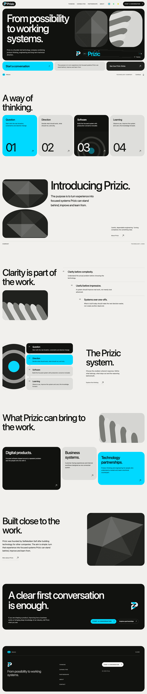

# Prizic website

The public site for Prizic: web design, business software and automation for local businesses.

Production: [prizic.com](https://prizic.com)



## Stack

Next.js 16, React 19, TypeScript, Tailwind CSS 4, Motion for React, Vitest, Testing Library and Playwright. The package manager is pnpm 10.

## Local development

```bash
pnpm install
pnpm dev
```

Development can run without contact or inquiry configuration. Email actions then render as `Contact destination pending` instead of inventing an address, and the inquiry form reports that it could not send.

## Checks

```bash
pnpm test
pnpm typecheck
pnpm lint
pnpm test:e2e
```

Playwright builds and starts its own production server on port 3100 with test-only local configuration.

## Production configuration

Set these to verified real destinations before running `pnpm build`:

- `NEXT_PUBLIC_SITE_URL`: canonical HTTP or HTTPS site URL
- `NEXT_PUBLIC_CONTACT_URL`: direct `mailto:`, HTTP or HTTPS contact URL, used by "Email Prizic"
- `OUTREACH_SUPABASE_URL`: the Outreach CRM's Supabase project URL
- `OUTREACH_SUPABASE_ANON_KEY`: that project's anon key (server-only; never prefix it with `NEXT_PUBLIC_`)

Production builds fail when any of them is absent or invalid.

Optional:

- `NEXT_PUBLIC_BOOKING_URL`: an HTTP or HTTPS introductory-call scheduler. The Contact page offers "Book an introductory call" only when it is set.

### Inquiries

The Contact form posts through a server action to the Outreach CRM's `outreach.submit_inquiry` RPC, defined by the `outreach_website_inquiries` migration in the Outreach repo. The anon role can call that one function and nothing else in the CRM, so the site holds no credential that can read leads or inquiries back. The RPC validates lengths, throttles repeat and bulk submissions, stores the inquiry in `outreach.inquiries`, and notifies the CRM's admins and leads. The team works inquiries on the CRM's Inquiries page. A hidden honeypot field drops obvious bots before any request is made. Once both are set in the environment:

```bash
pnpm build
pnpm start
```

Preview and development builds may omit them and show the truthful pending-contact state. Test-only addresses belong in commands or CI configuration, never in company content.

The production site is deployed from the `katanaz/prizic` Vercel project. The apex domain is the canonical address. Vercel stores the production and preview values for both public environment variables; update the contact destination there when the Prizic company inbox is ready.

## Site structure

Public routes are `/`, `/services`, `/services/websites`, `/services/business-software`, `/services/automation`, `/approach`, `/about` and `/contact`. The old `/thinking`, `/capabilities` and `/partnerships` routes redirect permanently. Approved public copy and navigation live in `src/content/site.ts`; update its typed contracts in `src/content/types.ts` when the shape changes. Runtime configuration is validated in `src/lib/site-config.ts` and `src/lib/inquiry-endpoint.ts`.

Styling is Tailwind utilities only. Design tokens (colors, type scale, radii, breakpoints, keyframes) live in the `@theme` block of `src/app/globals.css`; there are no custom CSS classes. The accent switcher swaps the `--color-accent` pair on `<html>` at runtime.

Approved runtime logos live in `public/brand/`. Their source exports are under `02 Brand/Logo/Prizic/` in the company operations workspace. Treat those source files as authoritative and do not redraw or overwrite them.

The site sells services, not products. Do not add project names, product listings, repository or portfolio links, screenshots of unpublished systems, customer logos, testimonials, case studies, awards, guarantees, staff-size or years-of-experience claims, or performance metrics. Customer situations on the homepage are illustrative, not delivered work. Real proof can be added after it is approved and represented accurately. `assertPublicContent` fails the build on the most likely of these.
